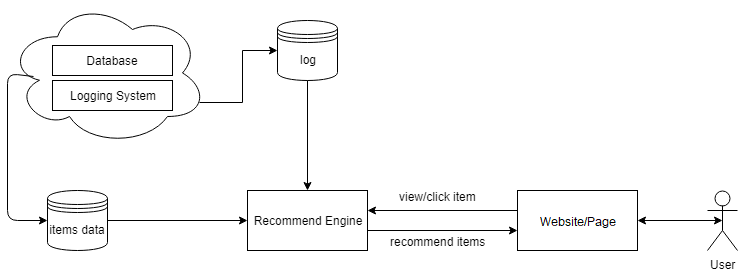
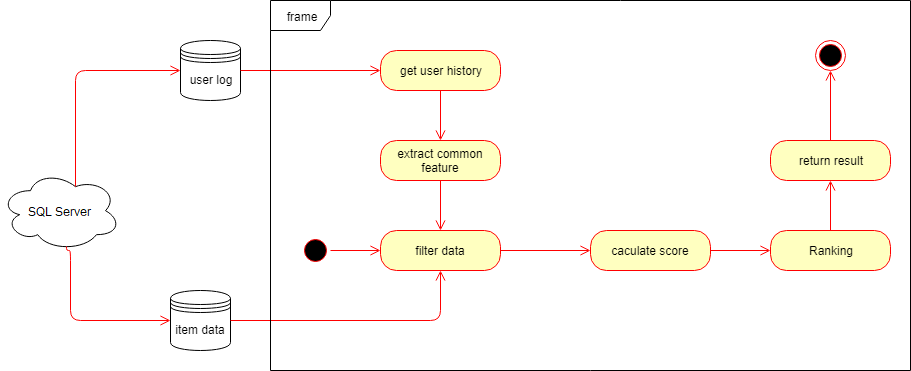

# recsys
This is a fully basic architecture for a recommender system with content-based approach. The first version implemented all components that need for the system to be deployed into production. However, there were some differences with the final deployed-version (which is not published here with more runtime optimizations, e.g: string initilization).
Target use-case: a real-estate website which publishes everyday articles about sell/buy/rent properties. The recommender system helps increasing user engagement by providing more relevant articles based-on user's personal interest.

Deployment system: Windows Server/SQL Server/Java/Maven 3.x

## Recommendation module
Calculate the most similar articles based-on the reading history of an user. It's done by comparing the similarity of (text) content of articles, then combined with the closeness of other features (price, location, type of property, ...).

## Dependence modules

### Item database
Process new articles, update dictionary (required for module _text similarity_), remove out-dated articles, ...

### User log
Process user's reading history from a logging database. Update user's profile with new reading activities. Manage user cache.
